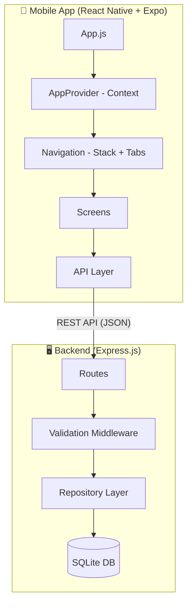

<div align="center">

# Re-Start

[](LICENSE)
[](https://expo.dev)
[](https://nodejs.org)

**A mobile support app that helps people in hospital stay motivated through rehabilitation and recovery tasks.**

[Features](#-features) · [Screenshots](#-screenshots) · [Tech Stack](#-tech-stack) · [Getting Started](#-getting-started) · [Architecture](#-architecture) · [Lessons Learned](#-lessons-learned) · [Roadmap](#-roadmap)

</div>

---

## 💡 Elevator Pitch

Re-Start is a React Native mobile application designed to support people in hospital through rehabilitation and recovery. It provides a safe place where users can connect, stay motivated with personalized recovery suggestions, and track progress through daily wellbeing activities — all in a clean, intuitive interface.

---

## ✨ Features

- **Real-time messaging** — One-to-one chat with message history and delivery status
- **Smart friend suggestions** — AI-powered compatibility matching based on recovery goals, interests, and location
- **Daily challenges** — Gamified wellness tasks (exercise, mindfulness, journaling) to encourage rehabilitation and recovery habits
- **Friendship system** — Send/accept/reject connection requests with state management
- **User profiles** — Customizable bio, privacy settings, notification preferences, multi-language support
- **Search & filters** — Find peers by recovery goals, nationality, age, and employment status
- **Challenge progress tracking** — Visual completion indicators and achievement history

---

## 🛠 Tech Stack

| Layer | Technology |
|-------|-----------|
| **Mobile App** | React Native 0.74 + Expo SDK 51 |
| **Navigation** | React Navigation 6 (Stack + Bottom Tabs) |
| **State Management** | React Context API |
| **UI Components** | React Native Elements, Styled Components, Gifted Chat |
| **Backend** | Node.js + Express 4.21 |
| **Database** | SQLite (better-sqlite3) |
| **Validation** | express-validator |
| **Security** | Helmet, CORS, input sanitization |
| **Testing** | Jest, Supertest, React Testing Library |
| **CI/CD** | GitHub Actions |
| **Containerization** | Docker (Alpine-based, non-root, healthcheck) |
| **Linting** | ESLint + Prettier |

---

## 🚀 Getting Started

### Prerequisites

- **Node.js** ≥ 18
- **npm** ≥ 9
- **Expo CLI**: `npm install -g expo-cli`
- **Expo Go** app on your phone (for testing on device)

### Installation

```bash
# Clone the repository
git clone https://github.com/saultab/restart-app.git restart-app
cd restart-app

# Setup server
cd server
cp .env.example .env
npm install
npm run dev        # Starts on http://localhost:3001

# Setup client (in a new terminal)
cd ../client
npm install
npm start          # Opens Expo DevTools
```

### Running with Docker (Server)

```bash
cd server
docker build -t re-start-server .
docker run -p 3001:3001 re-start-server
```

Verify it works:
```bash
curl http://localhost:3001/api/health
# {"status":"ok","timestamp":"..."}
```

### Running on Device (Client)

1. Install **Expo Go** on your phone ([Android](https://play.google.com/store/apps/details?id=host.exp.exponent) / [iOS](https://apps.apple.com/app/expo-go/id982107779))
2. Run `npm start` in the `client/` folder
3. Scan the QR code with your phone — the app auto-connects to the server on the same network
4. Alternatively: press `a` for Android emulator, `i` for iOS simulator, or `w` for web browser

---

## 🏗 Architecture



### Project Structure

```
restart-app/
├── .github/workflows/ci.yml   # GitHub Actions CI pipeline
├── server/
│   ├── Dockerfile              # Production container (Alpine, non-root)
│   ├── src/
│   │   ├── index.js            # Server entry point
│   │   ├── app.js              # Express app configuration
│   │   ├── routes/             # Route definitions with validation
│   │   ├── middleware/         # Error handling & input validation
│   │   └── db/                 # Repository pattern for data access
│   └── __tests__/              # API integration tests
├── client/
│   ├── App.js                  # Entry point (minimal, delegates to context)
│   ├── src/
│   │   ├── api/index.js        # Centralized API client with error handling
│   │   ├── context/AppContext.js # Global state management
│   │   └── utils/assets.js     # Asset maps (O(1) image lookup)
│   ├── navigation/             # Stack and tab navigators
│   ├── screens/                # Screen components
│   ├── components/             # Reusable UI components
│   └── styles/                 # Styled-components definitions
└── README.md
```

---

## 🧠 Lessons Learned / Technical Challenges

### State Management at Scale
The original version used 15+ `useState` hooks and 7 boolean flags (`dirty1`...`dirty7`) in a single 450-line component. Migrating to React Context with semantic naming (`shouldRefreshMessages`, `shouldRefreshChats`) dramatically improved readability and maintenance.

### Prop Drilling vs Context
Passing 15+ props through 3-4 levels of navigation was a major code smell. The Context API eliminated this without introducing heavy dependencies like Redux for a medium-sized app.

### Performance: O(n) → O(1) Asset Lookup
The original code used `.filter()` on arrays of 40 items for every image render. Converting to a hash map (`{ userId: require('...') }`) eliminated unnecessary iterations.

### Input Validation & Security
The original server had zero input validation — any string could be inserted into SQL queries. Adding `express-validator` with sanitization prevents XSS and ensures data integrity without over-engineering.

### Synchronous SQLite
Migrating from the callback-based `sqlite3` package to `better-sqlite3` (synchronous) simplified the data access layer and eliminated nested Promise chains in a single-process server.

---

## 🗺 Roadmap

- [ ] **Authentication** — Firebase Auth or JWT-based login/registration
- [ ] **Real-time messaging** — WebSocket integration (Socket.io) for instant message delivery
- [ ] **Push notifications** — Expo Notifications for new messages and challenge reminders
- [ ] **TypeScript migration** — Full type safety across client and server
- [ ] **Offline support** — Local SQLite cache with sync when online
- [ ] **Accessibility** — WCAG 2.1 AA compliance, screen reader support
- [ ] **Deployment** — Server on Railway/Render, client as standalone APK/IPA
- [ ] **Image upload** — Profile pictures stored in cloud storage (S3/Cloudinary)
- [ ] **Pagination** — Virtual list with infinite scroll for messages and users
- [ ] **i18n** — Full internationalization with react-i18next

---

## 📄 License

This project is licensed under the MIT License — see the [LICENSE](LICENSE) file for details.

---

## 📬 Contact

**Vittorio Tabarè**

[](https://www.linkedin.com/in/vittorio-tabare/)
[](https://github.com/saultab)
